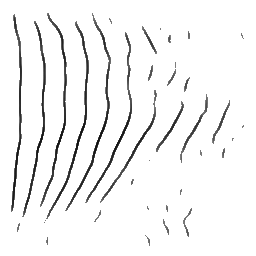

# Automatic detection of Ionospheric Alfvén Resonances using U-net

This repository was maintained by Paolo Marangio as part of the Dissertation project counting towards the degree of Master of Science in High Performance Computing with Data Science. The work presented here is the result of a collaboration between the Edinburgh Parallel Computing Center (EPCC) and the British Geological Survey (BGS).

---

## Overview

### Data

The data about the IARs phenomenon has been collected by BGS over the past 7 years using high frequency induction coils installed at Eskdalamuir Observatory. This has been devided into 178 days used for training and 2135 days used for testing. You can find these images(size 701x1101) in folder data/membrane.

### Neural Network

This repository has been forked from the repository made by https://github.com/zhixuhao/unet. Following that, the codebase was adpated according to our needs.

In order to achieve the task of segmentation on images displaying IARs signal, the fully convolutional neural network U-net is implemented with Keras functional API.

This is the reference to the original paper describing the U-net architecture [U-Net: Convolutional Networks for Biomedical Image Segmentation](http://lmb.informatik.uni-freiburg.de/people/ronneber/u-net/).

Output from the network is a 256x256 image that represents the segmentation mask generated for a given test image.

### Training

U-net is trained for 10 Epochs on IARs training data with binary crossentropy as loss function and Intersection over Union(IoU) as evaluation metric. On a dataset of 178 training examples, it achieved a training loss of 0.2783 and an IoU score of 0.8265.

### Testing

Model is used to generate predictions for test images. 

#

#

### Branches overview

| Branch name | Feature  |
| -------------        | -------------
| activations heatmaps    |experiments with keract package   |
|alternative loss functions  |experiments with alternative loss functions   |    
|code profiling | timing entire code before and after HPC optimizations                                |
|image size experiments |experiments with finalized model on images of larger size                                 |
|k unet cross valid  | implementation of K U-net with cross-validation                                |
|  master                   | experiments with finalized model          |
|parallelization experiments repeated   |repeats of some multithreading experiments             |
|  parallelization experiments   | experiments with multithreading and GPU parallelization     |
|  hyperparameter tuning tests                  |experiments for identifying best hyperparameter values    |
|x unet cross valid  |implementation of X U-net with cross-validation             |
|vanilla x unet    |vanilla implementation of X U-net     |

---

# Get started

Set up (Cirrus at EPCC):

* [Set up Cirrus environment](./docs/setup-cirrus.md)

Training and testing U-net:

* [Submit job to Standard or GPU compute node ](./docs/training-testing-unet.md)

---

## Overview of code used to generate Tables and Figures in Dissertation manuscript

### Chapter 5

| Figure (F) and/or Table (T)  | Commit        | Branch  | 
| -------------        | ------------- | ------- |
| F5.1         |TBA   |TBA         |
| F5.2, T5.1         | f28b02bef9b04e335270e1864a1726309d5541d0  | vanilla x unet  |
| F5.2, T5.1         | 18788411c90fe0630299c6c61413a6a42d6f1fe7  | vanilla x unet  |
|F5.2, T5.1         | adf7e58961d4d0d4b6ba54ff3efbc42cef8cf01f  | vanilla x unet  |
|F5.2, T5.1         | 3d438e1ee001a40fc7f3aeb78a19cf45ede35f26  | vanilla x unet  |
|F5.3          |8035f8875653fd591909af2cc4ef698b33066877 | x unet cross valid     |
|F5.3          |042b2fe4ebf1b5cdb295beccb31cbce58fbff149 | x unet cross valid     |
|F5.3          |f6c8b7225ed0f1752d0c92ce04ada55a2a1e2ae6 | x unet cross valid     |
|T5.2        |  18788411c90fe0630299c6c61413a6a42d6f1fe7   |alternative loss functions|
|T5.2       |b46ef2618e796373878dc9885dbc431ff7513a3b   |alternative loss functions  |
|T5.2     |75627c0a1ef794f2f37b0d259dc13ceb16ba0aeb   |alternative loss functions |
|T5.4    |1aaf33c504faf135e677658468c3071b28f3a310  | x unet cross valid    |
|T5.4    |0d6cf42fbc749a453b99e500986cf773ec2c2e34  | k unet cross valid   |
|F5.5      |TBA         |TBA                 |
|F5.5     |bb91275bbbf0e2147e3e38cbc9306628b664a7e8    | k unet cross valid    |
|T5.5     |c1ffc53039082a151033004e0728e9ede729be4d   | hyperparameter tuning tests |
|T5.6     |d1e6fb6611de7821dfc5032f3264673da31c4aca  | hyperparameter tuning tests  |
|F5.7,T5.7     |ea51ba9cc5b5f73d3efce69f65d0588772abad3f  | master                |
|T5.7     |8fd879577eb190ffc54d606a23452364ab647be7  | master                |
|T5.7     |21f984c8ed8e66f4dcb97b61cf51580156b5521b  | master                |
|F5.8, F5.12, F.13 | 11948146f5822df2653d464cedd30c70cdc2522a    |master         |
|F5.9, T5.8     |b7c4aedd3ace6fe7a721b6a651dd77351fd74acd         | master        |
|F5.9, T5.8     |51590003f95ac67ca77c95d7287c4ea8874e9402  | master        |
|F5.9, T5.8     |650c6968914ca0ea34eae588747c427af3a25ff3         | master        |
|F5.10     |a77f3505b7540f794b005b908e586f182900b778         |x unet cross valid   |
|F5.11     |d94ef232d64b494c0f2ebaa82a9130ce5209d026     |master                 |
|F5.14  |8a609fdc931da90fb2fc61fa5ba9e2e41b6f69a9    |image size experiments   |
|F5.15     | e8b3e3f753b864e5969616280f24925eb797f343        |image size experiments   |
|F5.17,5.18,5.19|0f26f794b87103dafa0c8138d96c60e175412886|activations heatmaps|

### Chapter 6
TBA

## About Keras

Keras is a minimalist, highly modular neural networks library, written in Python and capable of running on top of either TensorFlow or Theano. It was developed with a focus on enabling fast experimentation. Being able to go from idea to result with the least possible delay is key to doing good research.

Keras has the following features:

- allows for easy and fast prototyping (through total modularity, minimalism, and extensibility).
- supports both convolutional networks and recurrent networks, as well as combinations of the two.
- supports arbitrary connectivity schemes (including multi-input and multi-output training).
- runs seamlessly on CPU and GPU.
Documentation can be found here [Keras.io](http://keras.io/)

